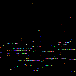
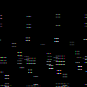
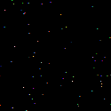

# Diffusion Models for Fast Detector Simulation
Three channels of images are extracted :

1. ECAL 

2. HCAL

3. TRACK

## Task 1 : Auto-encoder of the quark/gluon events
## Task 2 : Jets as graphs 

## Downloads
1. Dataset can be downloaded from : https://drive.google.com/file/d/1WO2K-SfU2dntGU4Bb3IYBp9Rh7rtTYEr/view?usp=sharing